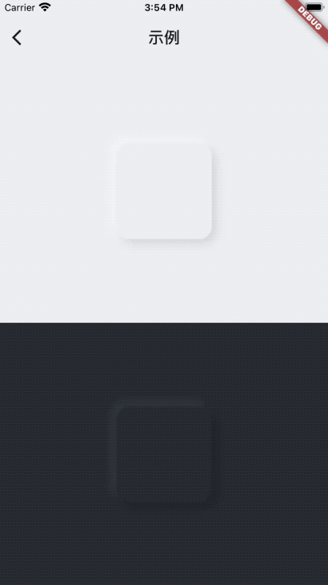
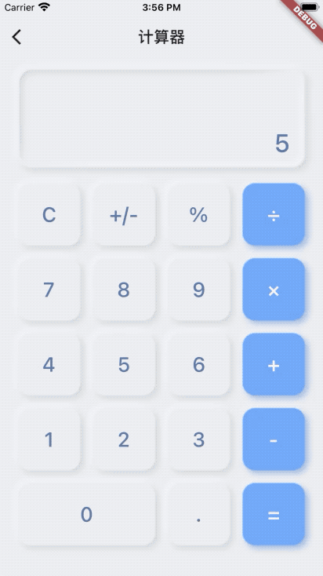

# 新拟态装饰


## 安装
在`pubspec.yaml` 文件中添加`neumorphism_decoration`依赖:

```yaml
dependencies:
  neumorphism_decoration: ^${latestVersion}
```


## 使用
```dart
NeumorphismDecoration(
    child: SizedBox(
        width: 120,
        height: 120,
    ),
)
```


## 特性

### NeumorphismDecoration 参数

|       name        |          type           |   need   |                    desc                    |
| :---------------: | :---------------------: | :------: | :----------------------------------------: |
|       child       |         Widget          | optional |                                            |
| neumorphismColors |    NeumorphismColors    | optional |   自定义颜色，包含背景色、阴影颜色和光源颜色    |
|       radius      |         double          | optional |                    圆角                    |
|       bevel       |         double          | optional |              视觉上凸起的高度                |
|       style       |    NeumorphismStyle     | optional |     设置样式，包含自动、固定凸起和固定凹陷      |
|       onTap       |        Function         | optional |                  点击事件                   |


## 截图

|  示例  |  计算器  |
| ----- | ------ |
|  |  |
